This is the repository for COMP5411 Advantage Computer Graphics in HKUST (year2021). 

In this class I have complete some assignments and a final project.

Assignments include:
- [Laplacian Smoothing](#assignment-1-laplacian-smoothing)
  - [explicit](#explicit)
  - [implicit](#implicit)
- [Naive Laplacian Deformation](#assignment-2-naive-laplacian-deformation)

Final Project:
- [Rendering Fur On Bunny](#final-project-rendering-fur-on-bunny)

# Final Project: Rendering Fur On Bunny

Our group using webgl and three.js to render fur on a bunny object. We also render a background scenario and illuminate some light effects.

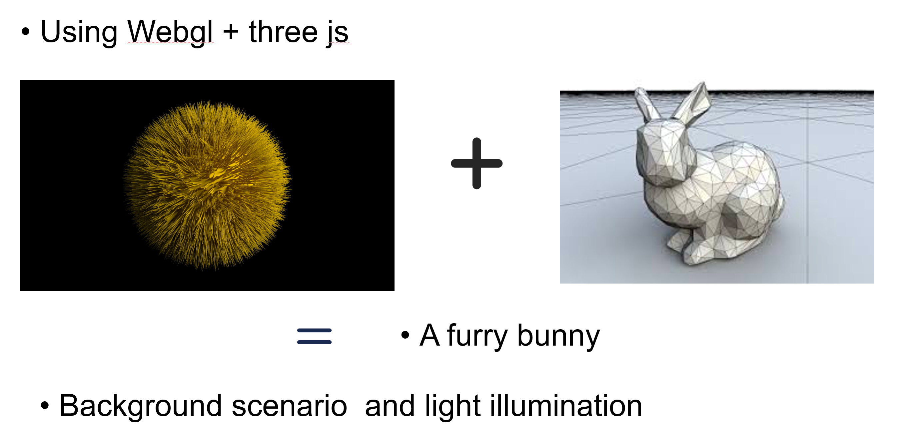

The proposal of our project is here. [proposal](https://github.com/hutslib/Advanced-Computer-Graphics/blob/main/finall_project/proposal.pdf)

Here is the proposal video for our project:

<iframe width="100%" style="height: calc(60vw); max-height: 512px" src="https://www.youtube.com/embed/03RzWorSsOs" title="YouTube video player" frameborder="0" allow="accelerometer; autoplay; clipboard-write; encrypted-media; gyroscope; picture-in-picture" allowfullscreen></iframe>

Please check more details in the [proposal video](https://youtu.be/03RzWorSsOs).

#### The major challenges we faced are: 
  
- How to generate a real-time realistic fur 
- How to import a complex obj module into the program
- How to set background scene and finish the light illumination

### 1. How to generate a real-time realistic fur:

First, we sample some points on each mesh of the bunny randomly. How many points we sample decides the fur density. We call this plane with sampled points one slice. 

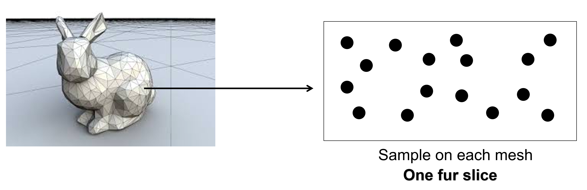

Then we grow slices on the direction of mesh normal. It means we convert a fur fiber into several fur points along the mesh normal direction.

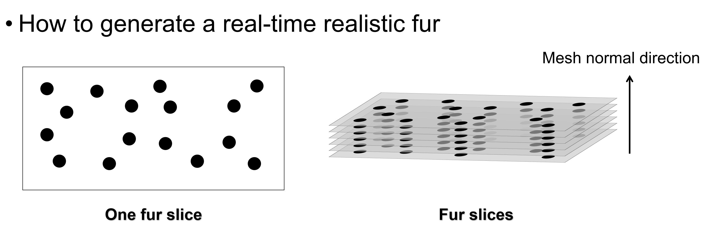

And when one piece of fur slice moves around, all the fibers in this group moves. This operation fastens the rendering computation efficiently to avoid calculating each fiber’s movement.

### 2. How to import a complex obj module into the program:

Our bunny.obj files contains faces and vertices. However, we also need to know the normals of each face and how does the texture map onto each slice. So we utilize blender to pre-compute these normals and texture maps.

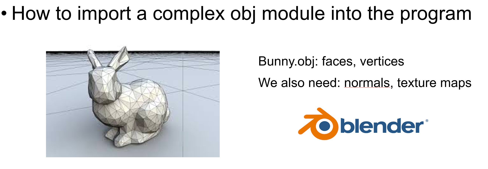

Then we found that .obj can’t save these parameters. So we convert the models into .js file which contains the whole information.

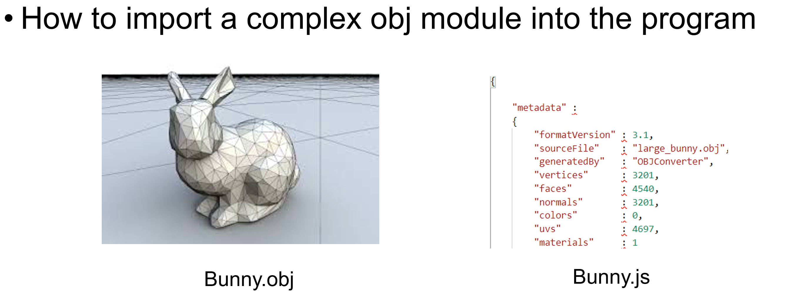

What’s more, we also remesh the bunny to have a uniform density of fur. And we do the smooth operation to have a soft varying normals.

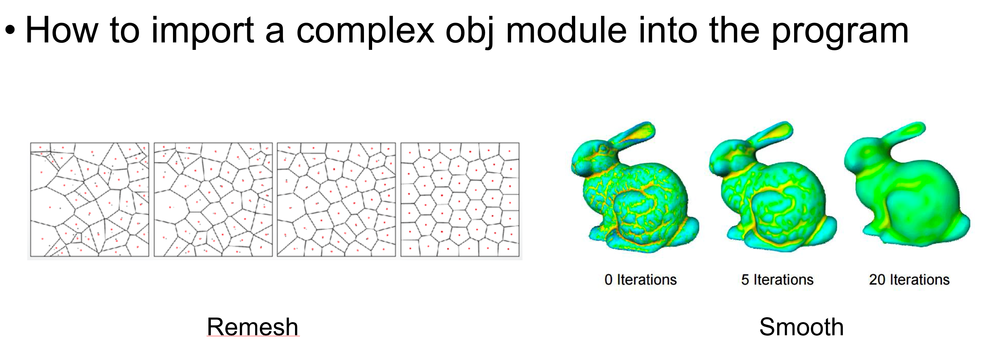

### 3. How to set background scene and finish the light illumination:

We add background texture to simulate bunny is on a moon and using the phong illumination model and phong shading algorithm.

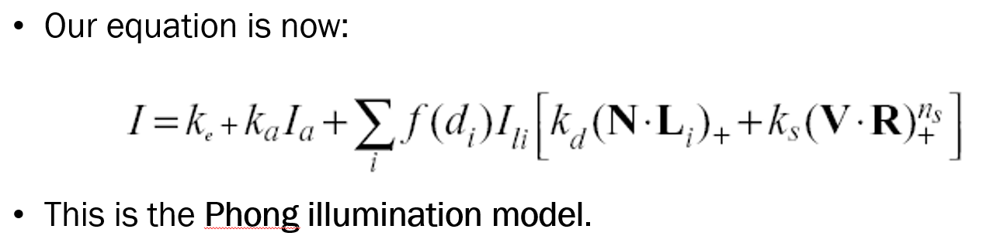

### video:

Here is the firnal report video for our project:

<iframe width="100%" style="height: calc(60vw); max-height: 512px" src="https://www.youtube.com/embed/KoC0cmfwZ74" title="YouTube video player" frameborder="0" allow="accelerometer; autoplay; clipboard-write; encrypted-media; gyroscope; picture-in-picture" allowfullscreen></iframe>

Please check more details in the [final video](https://youtu.be/KoC0cmfwZ74).

# Assignment 1: Laplacian Smoothing
I implement the explicit Laplician smoothing using the uniform weights and the cotangent weights. And I also implement the implicit Laplacian smoothing using uniform weights and cotangent weights.The result and report of this assignment is here. [Laplacian Smoothing Report](https://github.com/hutslib/Advanced-Computer-Graphics/blob/main/Laplacian_Smoothing/report1.pdf) 

## explicit
#### uniform weights

Find the average position for the all the neighbors of point Xi. Using the difference between the average point and the point Xi to indicate the direction to smooth the point Xi.

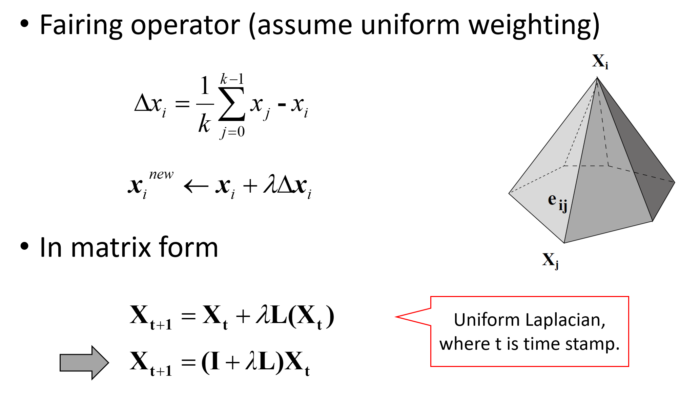

#### contagent weights

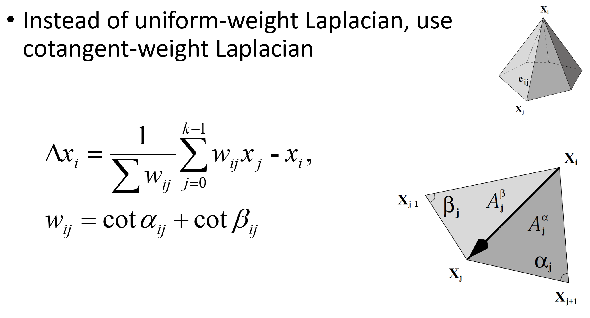

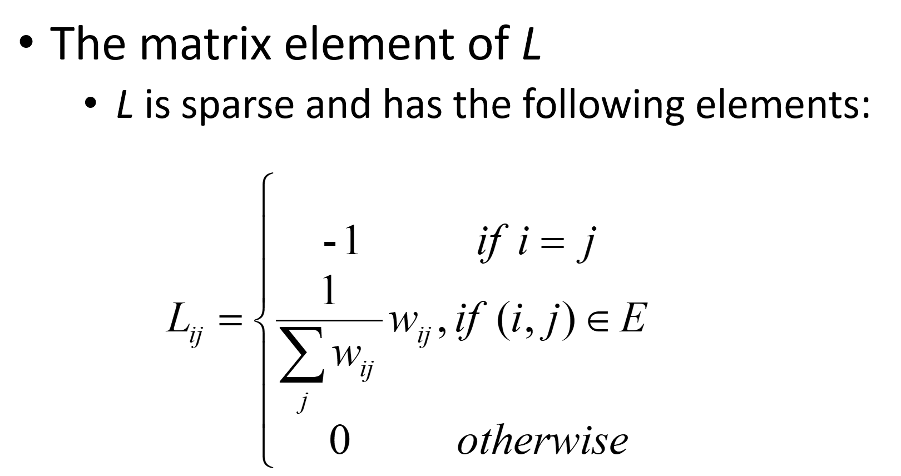

## implicit

implicit integration approximate derivative using the new mesh.

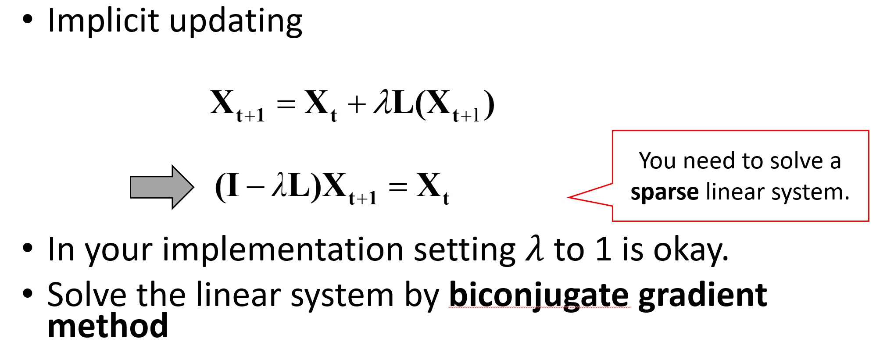

# Assignment 2: Naive Laplacian Deformation
I implement the naive Laplacian deformation. I use the differential coordinate to encode the geometric details of each vertex. People can select some points to move and the deformation problem can be formulated as a least square problem, whcih contains two part: the regularization part and the matching part. A paper and report show the method in detail is here. [Naive Laplacian Deformation paper and report](https://github.com/hutslib/Advanced-Computer-Graphics/blob/main/Naive_Laplacian_Deformation/Naive-Laplacian-Deformation_report.pdf)

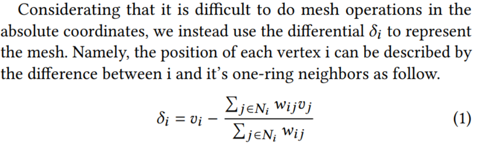

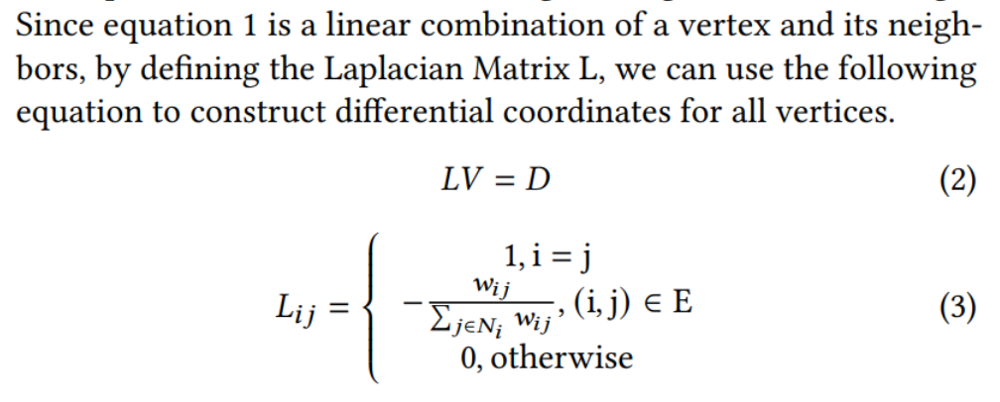

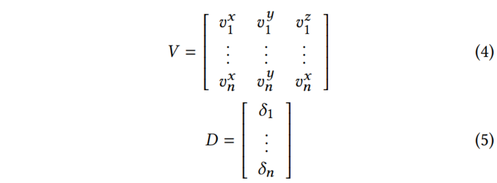

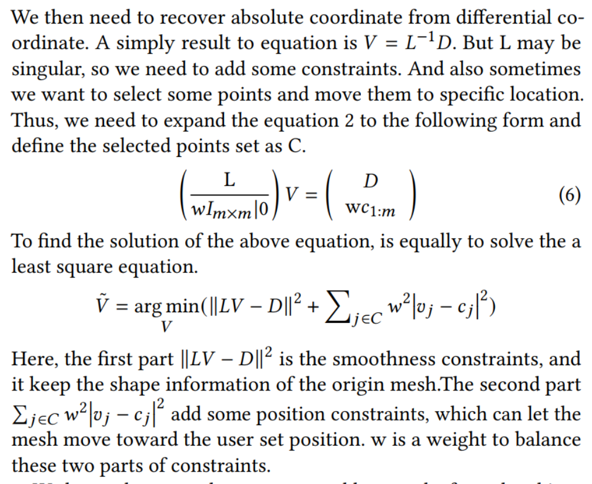

The result video is here.

<iframe width="100%" style="height: calc(60vw); max-height: 512px" src="https://www.youtube.com/embed/KoC0cmfwZ74" title="YouTube video player" frameborder="0" allow="accelerometer; autoplay; clipboard-write; encrypted-media; gyroscope; picture-in-picture" allowfullscreen></iframe>

Please check more details in the [Naive Laplacian Deformation Video](https://youtu.be/sLAs1RXT7Tg).

